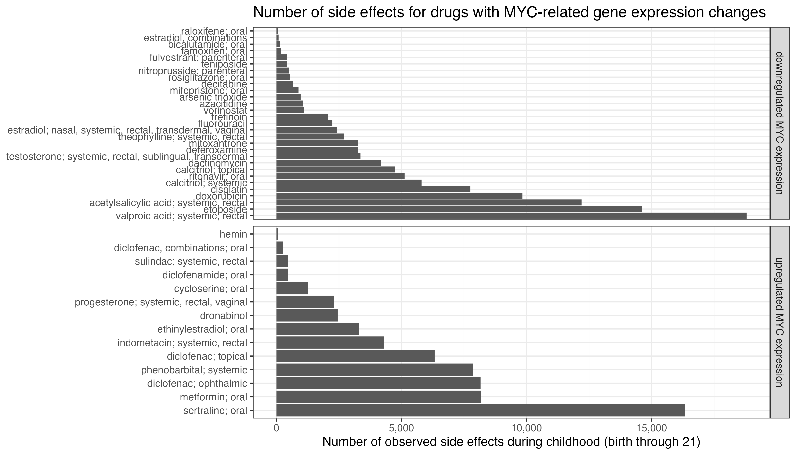
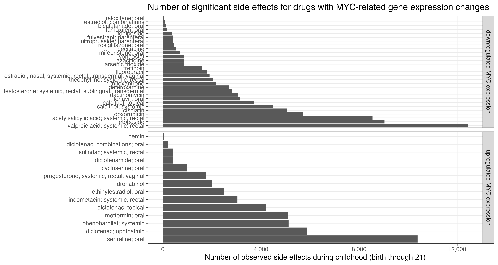
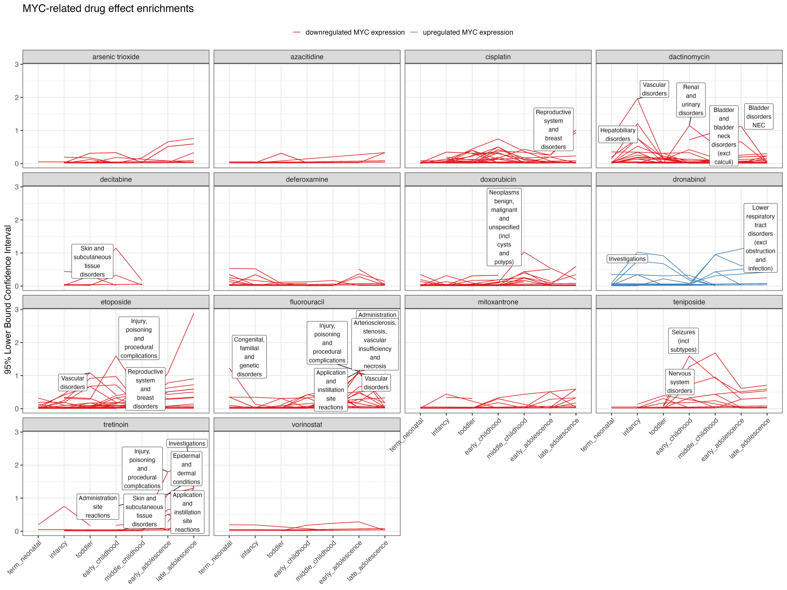

MYC-related pediatric drug safety profiles
================

## Background

[MYC](https://en.wikipedia.org/wiki/Myc#:~:text=The%20Myc%20family%20consists%20of,the%20viral%20gene%20v%2Dmyc.&text=In%20cancer%2C%20c%2Dmyc%20is,often%20constitutively%20(persistently)%20expressed)
is an oncoprotein and often implies worse outcomes, however it also
seems to have a role in cardiovascular disease. [The Gabriella Miller
Kids First Pediatric Research Program](https://kidsfirstdrc.org) has
devoted significant resources to collect and standardize next generation
sequencing data to investigate MYC in cardiovascular disease during
childhood.

[kidSIDES](https://github.com/ngiangre/kidsides) is an R data package
that contains observation, summary, and model-level data from pediatric
drug safety research. This resource can facilitate the investigation of
drug safety related to MYC expression, specifically drugs that are
substrates for MYC and proteins with its network.

## Motivation

The kidSIDES resource has the unique opportunity to generate MYC-related
pediatric drug safety profiles. Drugs can interact with proteins
(e.g. inhibitors, agonists) as well as be substrates for different
enzymes. The kidSIDES resource contains linkages between proteins
(UniProt IDs) and drugs (ATC IDs). Gene expression results can be linked
from genes (HUGO IDs) and proteins (Uniprot IDs). Through these
linkages, we can integrate expression of genes with drug
interactors/substrates. Then, the resource allows linking with
potentially significant side effects across childhood for generating
drug safety profiles.

However, MYC is notorious for being “undruggable”
[Ref](https://www.ncbi.nlm.nih.gov/pmc/articles/PMC6337544/). MYCc is
actually a family of three homologs, where c-MYC (cellular MYC) is
constituently expressed in cancers and is a known upregulator of gene
expression. c-MYC binds to a non-specific DNA sequence to initiate
transcription, and is known to influence mammalian [cell
count](https://pubmed.ncbi.nlm.nih.gov/11742404/). Mitigating
overexpression of MYC is a hypothesized mechanism for treating
tumorigenesis by bromodomain (BRD) inhibitors such as
[JQ1](http://www.ncbi.nlm.nih.gov/pubmed/21889194). It was shown to be
an antiproliferative agent in a mouse model of multiple myeloma. A well
known side effect of BRD inhibitors is
[thrombocytopenia](http://www.ncbi.nlm.nih.gov/pubmed/32989227) which is
actually used as a pharmacodynamic biomarker. To date there are no FDA
approved BRD inhibitors.

So, ow can we investigate drug safety profiles related to MYC
expression? We used the pharmaco-transcriptomics feature in
[DrugBank](https://go.drugbank.com/pharmaco/transcriptomics) and
filtered by MYC to extract the drugs with any known association to MYc
expression alterations. In total, there are [43
drugs](Drug%20names%20taken%20from%20%5Bpharmaco-transcriptomics%20table%20on%20Drugbank%20where%20Gene==MYC%5D(https://go.drugbank.com/pharmaco/transcriptomics?q%5Bg%5B0%5D%5D%5Bm%5D=or&q%5Bg%5B0%5D%5D%5Bdrug_approved_true%5D=all&q%5Bg%5B0%5D%5D%5Bdrug_nutraceutical_true%5D=all&q%5Bg%5B0%5D%5D%5Bdrug_illicit_true%5D=all&q%5Bg%5B0%5D%5D%5Bdrug_investigational_true%5D=all&q%5Bg%5B0%5D%5D%5Bdrug_withdrawn_true%5D=all&q%5Bg%5B0%5D%5D%5Bdrug_experimental_true%5D=all&q%5Bg%5B1%5D%5D%5Bm%5D=or&q%5Bg%5B1%5D%5D%5Bdrug_available_in_us_true%5D=all&q%5Bg%5B1%5D%5D%5Bdrug_available_in_ca_true%5D=all&q%5Bg%5B1%5D%5D%5Bdrug_available_in_eu_true%5D=all&commit=Apply+Filter&q%5Bdrug_precise_names_name_cont%5D=&q%5Bgene_symbol_eq%5D=MYC&q%5Bgene_id_eq%5D=&q%5Bchange_eq%5D=&q%5Binteraction_cont%5D=&q%5Bchromosome_location_cont%5D=))
associated with up or down regulated MYC gene expression. See the
medication data [below](#meds).

We found varying drug safety signals for the 43 drugs in the kidSIDES
resource:

There were 29 and 14 drugs associated with MYC down and upregulated gene
expression, respectively. These groups each observed different side
effects in kidSIDES:

kidSIDES information includes the adverse drug effects that are
significant in comparison to randomly reported drugs and side effects:

We observed similar drug safety signal trends across childhood between
te MYC expression categories:

We hypothesize that for these 43 drugs, there are significant drug
safety signals across childhood for groups or classes of the observed
side effects. The evidence is the result of a 2x2 test for significant
signals of the drug for the side effects in the class. We show the lower
95% confidence interval to indicate a lower limit for the evidence
available:

## Hypotheses

1.  Pediatric drug safety profiles based on substrates for proteins in
    the MYC protein network provide a MYC-related pediatric drug safety
    profile.
2.  There are distinct pediatric drug safety profiles for drugs
    associated with upregulated vs downregulated MYCc expression.
3.  MYC expression profiles across childhood contain mutual information
    with MYC-related pediatric drug safety profiles.

## Methodology

1.  Identify MYC protein interaction/similarity network. Drugbank’s
    pharmaco-transcriptomics tool has possible expression-related
    changes by drugs for MYC.
    [Link](https://go.drugbank.com/pharmaco/transcriptomics?q%5Bg%5B0%5D%5D%5Bm%5D=or&q%5Bg%5B0%5D%5D%5Bdrug_approved_true%5D=all&q%5Bg%5B0%5D%5D%5Bdrug_nutraceutical_true%5D=all&q%5Bg%5B0%5D%5D%5Bdrug_illicit_true%5D=all&q%5Bg%5B0%5D%5D%5Bdrug_investigational_true%5D=all&q%5Bg%5B0%5D%5D%5Bdrug_withdrawn_true%5D=all&q%5Bg%5B0%5D%5D%5Bdrug_experimental_true%5D=all&q%5Bg%5B1%5D%5D%5Bm%5D=or&q%5Bg%5B1%5D%5D%5Bdrug_available_in_us_true%5D=all&q%5Bg%5B1%5D%5D%5Bdrug_available_in_ca_true%5D=all&q%5Bg%5B1%5D%5D%5Bdrug_available_in_eu_true%5D=all&commit=Apply+Filter&q%5Bdrug_precise_names_name_cont%5D=&q%5Bgene_symbol_eq%5D=MYC&q%5Bgene_id_eq%5D=&q%5Bchange_eq%5D=&q%5Binteraction_cont%5D=&q%5Bchromosome_location_cont%5D=).
    The drug IDs were found in kidsides based on the atc_concept_name
    name.
2.  Extract drug profiles based on drug IDs in kidSIDES
    (myc_related_drug_safety_data.R).
3.  Visualize safety profiles overall, by side effect, and drug
    (myc_related_drug_safety_plots.R).
4.  (Optional) Retrieve MYC gene expression data from Kids First
    platform.
5.  (Optional) Identify MYC-related pediatric drug safety profiles with
    mutual information with thhe MYC gene expression data.

## Ideal Output

1.  MYC protein network diagram (R notebook)
2.  MYC-related pediatric drug safety profiles

## Medication Data

| OMOP CONCEPT | NAME                     | Mode                                                           | Regulation    |
|:-------------|:-------------------------|:---------------------------------------------------------------|:--------------|
| 21603802     | arsenic trioxide         | systemic                                                       | downregulated |
| 21604305     | acetylsalicylic acid     | systemic, rectal                                               | downregulated |
| 21601441     | azacitidine              | systemic                                                       | downregulated |
| 21602517     | estradiol                | nasal, systemic, rectal, transdermal, vaginal                  | downregulated |
| 21602522     | estradiol, combinations  | systemic                                                       | downregulated |
| 21603837     | bicalutamide             | oral                                                           | downregulated |
| 21605260     | deferoxamine             | ophthalmic, parenteral                                         | downregulated |
| 21602625     | raloxifene               | oral                                                           | downregulated |
| 21600781     | rosiglitazone            | oral                                                           | downregulated |
| 21603748     | cisplatin                | inhalant, parenteral                                           | downregulated |
| 21603641     | diclofenac               | ophthalmic                                                     | upgregulated  |
| 21600819     | calcitriol               | systemic                                                       | downregulated |
| 21602040     | calcitriol               | topical                                                        | downregulated |
| 21603732     | doxorubicin              | parenteral, topical                                            | downregulated |
| 21602516     | ethinylestradiol         | oral (natural and semisynthetic estrogens, plain)              | upregulated   |
| 21603718     | etoposide                | systemic                                                       | downregulated |
| 21601436     | fluorouracil             | systemic                                                       | downregulated |
| 21603833     | fulvestrant              | parenteral                                                     | downregulated |
| 21601236     | hemin                    | systemic, topical                                              | upregulated   |
| 21603941     | indometacin              | systemic, rectal                                               | upregulated   |
| 21600747     | metformin                | oral                                                           | upregulated   |
| 21602623     | mifepristone             | oral                                                           | downregulated |
| 21603738     | mitoxantrone             | parenteral                                                     | downregulated |
| 21600435     | nitroprusside            | parenteral                                                     | downregulated |
| 21603151     | ritonavir                | oral                                                           | downregulated |
| 21604714     | sertraline               | oral                                                           | upregulated   |
| 21603942     | sulindac                 | systemic, rectal                                               | upregulated   |
| 21603831     | tamoxifen                | oral                                                           | downregulated |
| 21603719     | teniposide               | parenteral                                                     | downregulated |
| 21602510     | testosterone             | systemic, rectal, sublingual, transdermal                      | downregulated |
| 21603332     | theophylline             | systemic, rectal                                               | downregulated |
| 21603793     | \[U\] tretinoin          | systemic                                                       | downregulated |
| 21604422     | valproic acid            | systemic, rectal                                               | downregulated |
| 21603809     | \[U\] vorinostat         | oral                                                           | downregulated |
| 21601442     | decitabine               | systemic                                                       | downregulated |
| 21603730     | dactinomycin             | parenteral                                                     | downregulated |
| 21603096     | cycloserine              | oral                                                           | upregulated   |
| 21600503     | dronabinol               | inhalant, nasal, oral, topical                                 | upregulated   |
| 21603694     | diclofenamide            | oral                                                           | upregulated   |
| 21603959     | diclofenac, combinations | oral                                                           | upregulated   |
| 21604051     | diclofenac               | topical (antiinflammatory prep., non-steroids for topical use) | upregulated   |
| 21604393     | phenobarbital            | systemic                                                       | upregulated   |
| 21602542     | progesterone             | systemic, rectal, vaginal                                      | upregulated   |
